# PYNQ
[PYNQ-EMIO_Ethernet image DIY project](https://github.com/sure-wang/PYNQ.git)

工程文件参考在目录“Vivado_Project”下，其中PYNQ.zip内为vivado工程，“pynq-lite_image_sources_v3”下是可直接使用到镜像构建的硬件平台描述文件。
由于petalinux工程过于庞大（大概30多g），未共享出来。相信读者可以通过下面的教程自行制作。

**本项目涉及到的所有文件仅供学习交流，禁止用于商业用途！！！**
***
# 由**EMIO**驱动**以太网** 的PYNQ镜像自制教程

***

[^说在前面：请在安装Ubuntu系统时预留好大致80g存储空间，以免后面空间不足需要调整Ubuntu空间，那样很费劲。笔者预留的是32g，后来苦逼的修改成100g的，肥肠痛苦。顺带一提，整个过程并不难，但是比较费劲，笔者最终整个的工程大致有30多g，环境从0搭建（从Ubuntu系统开始）花费了两天左右。相信能让你坚持下来的，想必是热爱以及PYQN的魅力吧。]: 

*环境版本：*

​	*装好vivado2018.3、petalinux2018.3的Ubuntu16.04（预留好大致80g空间）*

*基础镜像版本：*

​	*pynq_rootfs_arm_v2.4*

*硬件：*

​	*一块拥有连接在PL端以太网以及连接在PS端USB的ZYNQ7010*（笔者使用的是 微相ZYNQ-Lite，以太网甚至还是百兆的，都没千兆）

*（其实其他高于这个的zynq芯片也是可以的。至于为啥以太网是连接在PL端的？要是我有连接在PS端的话我就不会发这篇文章了。。。只能说这板卡的价格太香了<希望这篇文章的出现不会让它涨价>，买的时候说不支持pynq，心有不甘。想到可以利用EMIO将其变为PS端的设备就尝试了一下。妹想到网上找了一圈居然没有使用EMIO以太网做PYNQ镜像的，自己踩了很多坑终于成功了，所以写下这篇文章分享一下，若是有同样需求的，可以参考一下。）*

***

​			**笔者并非专业嵌入式系统开发者，以下均为网上学来的操作或者笔者本人的心得体会，若有误，欢迎批评指正！**

***


[TOC]

## 一、环境搭建

​	由于过程繁琐，非本文重点，略。可参考购买板卡的店家的教程。开发环境中 vivado和petalinux版本 需一致。操作系统版本建议使用Ubuntu16.04。

## 二、硬件平台搭建

### 1.材料构成

​	为了完成PYNQ的SD img的成功生成，我们需要的材料有：
1.rootfs文件（不含内核信息的镜像，可以加速生成过程）其中ZYNQ7000采用的是arm镜像，ZYNQ UltraScale+采用的为aarch64镜像
2.开发板的板级描述文件，具体可分为两种形式：
1）直接提供bsp文件；
2）提供bit文件和hdf文件。

​	这里采用第二种，也是大家熟悉的一种。

### 2.硬件系统构建（Vivado工程）

​	1）创建vivado工程，添加ZYNQ7000 IP核，配置IP（如下图），需包括UART、SD、ENET、USB、ＧPIO。（管脚选择请参照自己板卡的原理图）


注意，由于板卡的以太网是接在PL端的，所以若是想要用PS驱动以太网，则需设置ENET时选择管脚为EMIO


​	2）引出以太网端口（笔者使用板卡的以太网芯片为MII模式的，所以引出总共八个，其他模式的需要根据特点进行连接，可以参照板卡自带的教程操作）


​	3）Create HDL Wrapper，配置引脚约束（主要为以太网的引脚约束），下面的约束仅供参考。

```verilog
set_property IOSTANDARD LVCMOS33 [get_ports {enet0_gmii_txd[3]}]
set_property IOSTANDARD LVCMOS33 [get_ports {enet0_gmii_txd[2]}]
set_property IOSTANDARD LVCMOS33 [get_ports {enet0_gmii_txd[1]}]
set_property IOSTANDARD LVCMOS33 [get_ports {enet0_gmii_txd[0]}]
set_property IOSTANDARD LVCMOS33 [get_ports {enet0_gmii_rxd[3]}]
set_property IOSTANDARD LVCMOS33 [get_ports {enet0_gmii_rxd[2]}]
set_property IOSTANDARD LVCMOS33 [get_ports {enet0_gmii_rxd[1]}]
set_property IOSTANDARD LVCMOS33 [get_ports {enet0_gmii_rxd[0]}]
set_property IOSTANDARD LVCMOS33 [get_ports ENET0_GMII_RX_DV_0]
set_property IOSTANDARD LVCMOS33 [get_ports {ENET0_GMII_TX_EN_0[0]}]
set_property IOSTANDARD LVCMOS33 [get_ports MDIO_ETHERNET_0_0_mdio_io]
set_property IOSTANDARD LVCMOS33 [get_ports MDIO_ETHERNET_0_0_mdc]
set_property IOSTANDARD LVCMOS33 [get_ports ENET0_GMII_RX_CLK_0]
set_property IOSTANDARD LVCMOS33 [get_ports ENET0_GMII_TX_CLK_0]
set_property PACKAGE_PIN K17 [get_ports ENET0_GMII_RX_CLK_0]
set_property PACKAGE_PIN L14 [get_ports ENET0_GMII_TX_CLK_0]
set_property PACKAGE_PIN K18 [get_ports ENET0_GMII_RX_DV_0]
set_property PACKAGE_PIN J14 [get_ports {enet0_gmii_rxd[0]}]
set_property PACKAGE_PIN K14 [get_ports {enet0_gmii_rxd[1]}]
set_property PACKAGE_PIN M18 [get_ports {enet0_gmii_rxd[2]}]
set_property PACKAGE_PIN M17 [get_ports {enet0_gmii_rxd[3]}]
set_property PACKAGE_PIN N16 [get_ports {ENET0_GMII_TX_EN_0[0]}]
set_property PACKAGE_PIN M14 [get_ports {enet0_gmii_txd[0]}]
set_property PACKAGE_PIN L15 [get_ports {enet0_gmii_txd[1]}]
set_property PACKAGE_PIN M15 [get_ports {enet0_gmii_txd[2]}]
set_property PACKAGE_PIN N15 [get_ports {enet0_gmii_txd[3]}]
set_property PACKAGE_PIN J15 [get_ports MDIO_ETHERNET_0_0_mdio_io]
set_property PACKAGE_PIN G14 [get_ports MDIO_ETHERNET_0_0_mdc]

set_property IOSTANDARD LVCMOS33 [get_ports ETH_RESET]
set_property PACKAGE_PIN H20 [get_ports ETH_RESET]

set_property CLOCK_DEDICATED_ROUTE FALSE [get_nets ENET0_GMII_RX_CLK_0_IBUF]
set_property CLOCK_DEDICATED_ROUTE FALSE [get_nets ENET0_GMII_TX_CLK_0_IBUF]

set_property SLEW FAST [get_ports {enet0_gmii_txd[3]}]
set_property SLEW FAST [get_ports {enet0_gmii_txd[2]}]
set_property SLEW FAST [get_ports {enet0_gmii_txd[1]}]
set_property SLEW FAST [get_ports {enet0_gmii_txd[0]}]
set_property SLEW FAST [get_ports {ENET0_GMII_TX_EN_0[0]}]
set_property SLEW FAST [get_ports MDIO_ETHERNET_0_0_mdio_io]
set_property SLEW FAST [get_ports MDIO_ETHERNET_0_0_mdc]

set_property SEVERITY {Warning} [get_drc_checks NSTD-1]
set_property SEVERITY {Warning} [get_drc_checks RTSTAT-1]
set_property SEVERITY {Warning} [get_drc_checks UCIO-1]
```

​	4）生成bit文件，export hardware（注意勾选include bitstream）。

## 三、PYNQ组件下载

### 1.板级镜像bionic.arm.2.x.img及开发包下载

```shell
开发包下载
git clone https://github.com/Xilinx/PYNQ.git
cd PYNQ
git checkout v2.4
git checkout -b Pynq-Lite
```

*注：*

*bionic.arm.2.x.img中 2.x 为版本，如本次软件版本2018.3对应的板级镜像为bionic.arm.2.4.img。下载地址：https://www.xilinx.com/member/forms/download/xef.html?filename=pynq_rootfs_arm_v2.4.zip     修改链接中的版本号可以下载对应版本的板级镜像。此镜像是为了后面在其基础上构建PYNQ镜像所用，先下载在任意位置即可。*

*第四行的“Pynq-Lite”为自己取的名字，后面也会用到，请保持一致。*

*板级镜像版本及第三行的版本与Xilinx Tool版本对应关系见下表*

| Release version | Xilinx Tool Version |
| --------------- | ------------------- |
| v2.2            | 2017.4              |
| v2.3            | 2018.2              |
| v2.4            | 2018.3              |
| v2.5            | 2019.1              |

### 2.检测安装依赖库环境

​	进入第一步下载的目录 **/PYNQ/sdbuild/scripts/**

​	打开命令框 运行 **setup_host.sh**

```shell
chmod +x setup_host.sh
./setup_host.sh
```

### 3.成功后通过终端打开编辑shell环境文件

```shell
sudo gedit  ~/.bashrc
```

​	在打开的文档末尾追加：

```shell
source /opt/pkg/petalinux/2018.2/settings.sh
source /opt/Xilinx/Vivado/2018.2/settings64.sh
source /opt/Xilinx/SDK/2018.2/settings64.sh
export PATH=/opt/qemu/bin:/opt/crosstool-ng/bin:$PATH
```
​	*这样每次打开终端就不需要source就可使用vivado、petalinux了。*

​	*当然，这样每次打开终端都会变慢。感觉影响使用的话，可以在制作好镜像后自己改回来。*

### ４.修改**newlib**文件

​	进入文件夹 /opt/crosstool-ng/lib/crosstool-ng-1.22.0/scripts/build/libc/
​	打开文件newlib.sh
​	将"{http://mirrors.kernel.org/sourceware/newlib, ftp://sourceware.org/pub/newlib}"
​	改为 “ftp://sourceware.org/pub/newlib"或者"http://mirrors.kernel.org/sourceware/newlib”
​	如图：
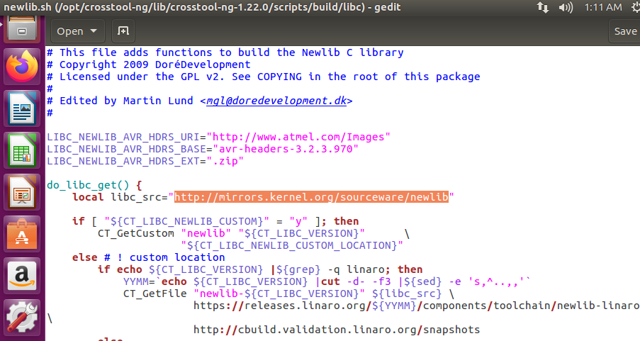

### ５.源文件修改

​	因为笔者并没有安装SDx环境，所用进入 /PYNQ/sdbuild/ 文件夹，打开Makefile

​	Ctrl+F查找、删除“which sdx | fgrep ${KERNEL_VERSION}”

## 四、框架移植

### 1.板级描述文件准备

​	在第二步创建的Vivado工程目录中找到
​	<project_name>.runs\impl_1<project_name>_wrapper.bit
​	<project_name>.sdk<project_name>_wrapper.hdf
​	其中<project_name>为你在Vivado中所命名的工程名
​	修改二者文件名为base.bit 以及system.hdf
​	其中bit流文件用于FPGA配置，hdf文件用于对已建立的Soc系统进行描述

### 2.镜像初次构建

​	1）在 /PYNQ/sdbuild/ 目录下新建文件夹 ‘prebuilt’，将bionic.arm.2.4.img文件拷贝至该文件夹

​	2）在 /PYNQ/boards/目录下新建文件夹“Pynq-Lite”（与上面的一致即可）

​	3）在/Pynq-Lite/中再新建两个文件夹分别为 base 和petalinux_bsp

​	4）在petalinux_bsp 中再建立文件夹 hardware_project

​	5）分别将base.bit拷贝到base；system.hdf拷贝到hardware_project

​	6）在/Pynq-Lite/中新建文件　Pynq-Lite.spec，打开并编辑如下 （其中所有“Pynq-Lite”均为自定义名字，和上面的保持一致即可）

```shell
ARCH_Pynq-Lite := arm
BSP_Pynq-Lite :=
BITSTREAM_Pynq-Lite := base/base.bit
```

​	7）返回 /PYNQ/sdbuild/ 打开终端，输入以下命令生成镜像（其中“Pynq-Lite”为自定义名字，和上面的保持一致即可）

```shell
make BOARDS=Pynq-Lite \
PREBUILT=./prebuilt/bionic.arm.2.4.img	
```

​	这是基于基础镜像的构建，大概会花费1~2个小时。最终生成的镜像会在自动新建的output文件夹下

在镜像生成过程中有些操作需要用到管理员权限，这时会提示输入密码，笔者每次第一次都是需要输入的，这时会停止镜像构建，需要再次输入上面的命令进行尝试。或者也可以和笔者一样修改**sudo命令的配置文件/etc/sudoers**，使用sudo命令时可以不用输入密码执行。

*由于是自制镜像，所以初次构建的无法识别USB设备；由于使用的是EMIO驱动以太网口（见过其他使用MIO驱动以太网的博主的文章描述 自制镜像未遇到这个问题，姑且认为是EMIO引起的吧），所以无法识别PHY。需要调整内核设置，并且添加相应的设备树，再次生成镜像才可正常使用。*

### 3.修改设备树、调整内核驱动后 再次构建镜像（***非常重要！！！***）

​	1）修改设备树（**一定要完成镜像的初次生成才可以，不然没法修改设备树！！**）

​	**在目录 /sdbuild/build//petalinux_project/project-spec/meta-user/recipes-bsp/device-tree/files下，打开文件 system-user.dtsi**

​		添加USB驱动

```shell
usb_phy0: usb_phy@0 {
compatible = "usb-nop-xceiv";
#phy-cells = <0>;
};
};

&usb0 {
dr_mode = "host";
usb-phy = <&usb_phy0>;
};
```

​		添加以太网驱动（“rtl8201”为板卡使用的网络芯片型号，如果添加的不对，镜像make时会报错）

```shell
&gem0{
compatible = "cdns,gem";
xlnx,ptp-enet-clock = <0x6750918>;
phy-handle = <&phy1>;
phy-mode = "rgmii-id";
phy1:phy@1 {
    compatible = "realtek,rtl8201","ethernet-phy-id001c.c816";
    device_type = "ethernet-phy";
    reg = <0>;
};
};
```

​		最终如下图所示

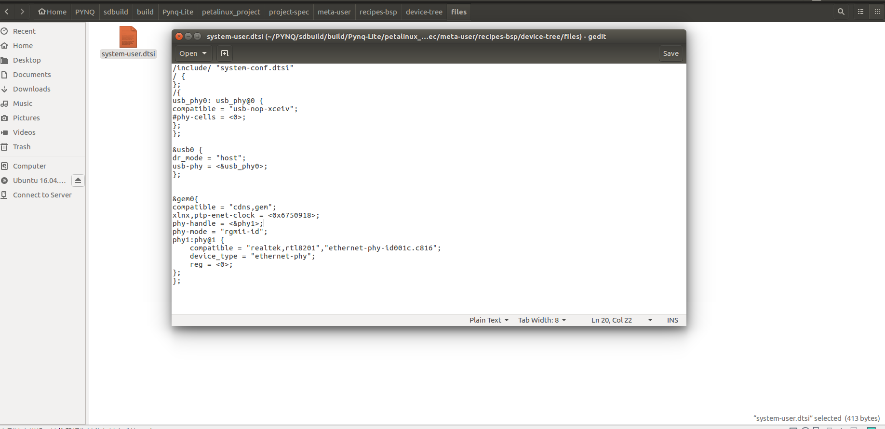

​	2）修改内核及驱动

​		**到/sdbuild/build/petalinux_project/目录下**

​		打开终端

​		输入`petalinux-config ` 将以太网设置为 ps7_ethernet_0 保存 退出

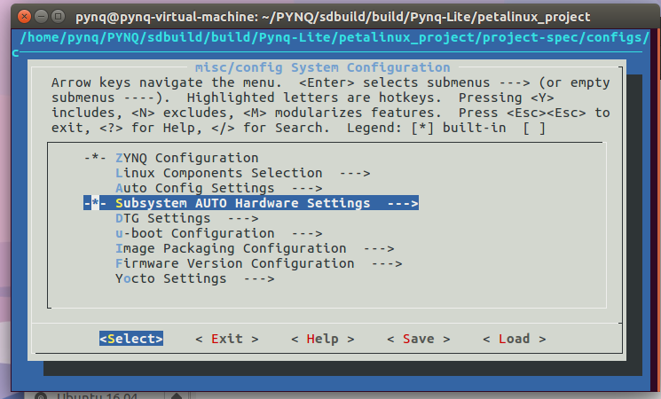

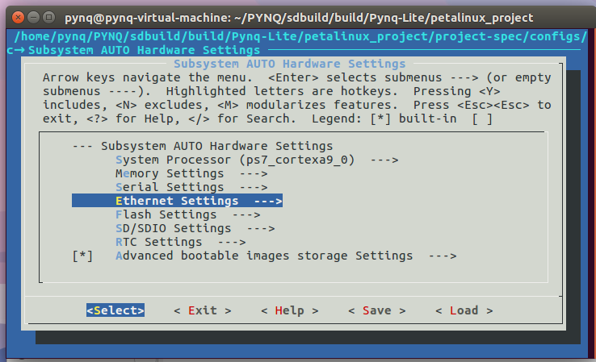

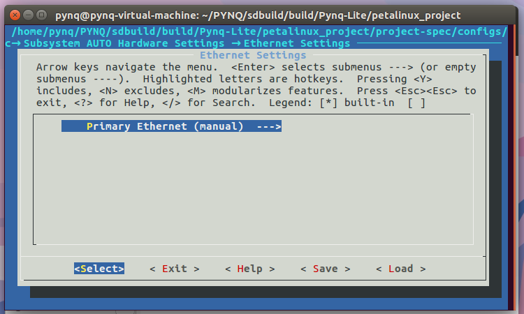

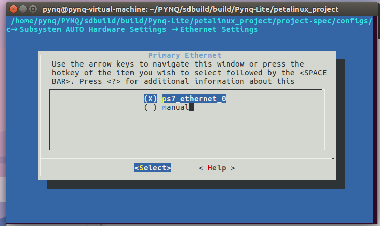

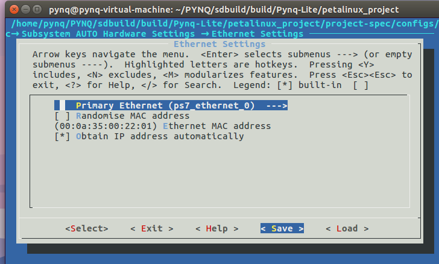

​		输入`petalinux-config -c kernel` 修改USB设置

​		*配置成host模式即可，由于默认是配置好的，就不演示了*

​		*若有需要请参考微相教程*

​	3）重新生成镜像

​		将之前output文件夹下的文件删除，再次运行make命令

```shell
make BOARDS=Pynq-Lite \
PREBUILT=./prebuilt/bionic.arm.2.4.img
```

​	4）找到output文件夹下.img文件，烧录镜像

## 五、镜像测试

*由于是自制镜像，所以上电后使用ifconfig命令查看无网络连接，需要进一步配置以太网，设置其静态IP地址等*

​	上电，连接终端打印出如下信息，则表明系统启动成功。

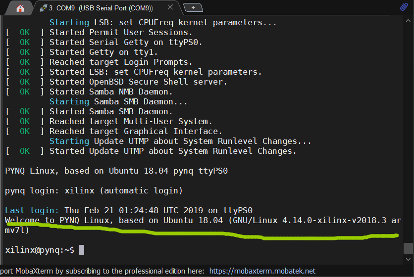

### 1.输入命令`sudo vi /etc/network/interfaces`

​	在打开的文件中 最后一行前添加(vi/vim编辑器编辑)

```shell
auto eth0
iface eth0 inet static
address 192.168.2.99
netmask 255.255.255.0
gateway 192.168.2.1
```

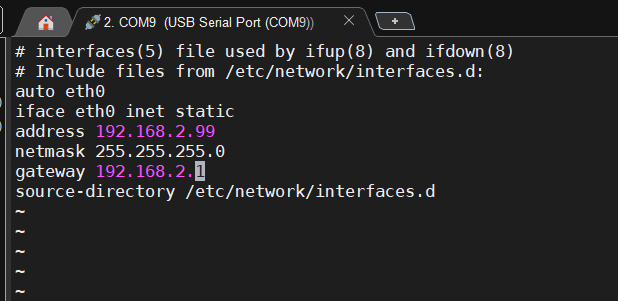

### 2.输入命令`sudo vi /etc/resolv.conf` 配置DNS

​	很多博文建议在打开文件的最后添加

```shell
nameserver 114.114.114.114
nameserver 114.114.115.115
```

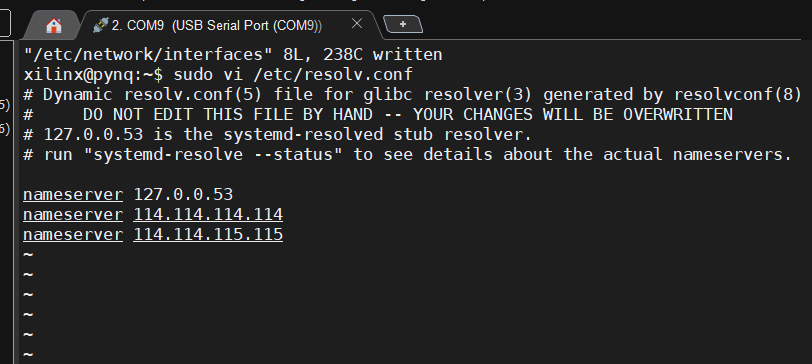

*dns是nameserver的一种，这里当作dns就好了，从文档的上面注释可以看出，在resolv.conf中修改是不行的，会被重新覆盖。笔者测试了一下，发现刚刚修改完是好的，如果重启系统，内容就会还原了。所以需要在/etc/resolvconf/resolv.conf.d/tail增加内容。（当然上面的可以不用做了）*

​	输入命令`sudo vi /etc/resolvconf/resolv.conf.d/tail`

​	添加

```shell
nameserver 114.114.114.114
nameserver 114.114.115.115
```

​	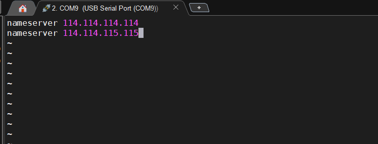

​	这样重启系统以后不会被消除，输入`sudo vi /etc/resolv.conf`即可查看。（重启前虽然配置好了，但是是无法通过这个方式看到的，重启后会在这个文件中自动加入）

*不过就算没有DNS也是不影响登录Jupyter Notebook的，笔者之前也没意识到重启系统会消除，但是重启后没有DNS仍然能登录192.168.2.99:9090。毕竟没有用到解析。*

### 3.输入命令 `/etc/init.d/networking restart` 重启以太网

​	系统会要求输入密码，输入 `xilinx` 即可

### 4.ping一下主机（笔者是将板子的以太网连接到主机的，主机设置的静态IP：192.168.2.12   将其替换成自己设置的即可）

`ping 192.168.2.12`

*注意：主机地址需要和板子在同一网段，既前三位为192.168.2。若是ping不通，关闭一下防火墙再次尝试即可。*

​	ping通则表面以太网可以正常使用

### 4.登录***Jupyter Notebook***

​	打开浏览器输入地址：192.168.2.99:9090

​	若能登录则pynq联网成功

​	点开一个测试例程，运行

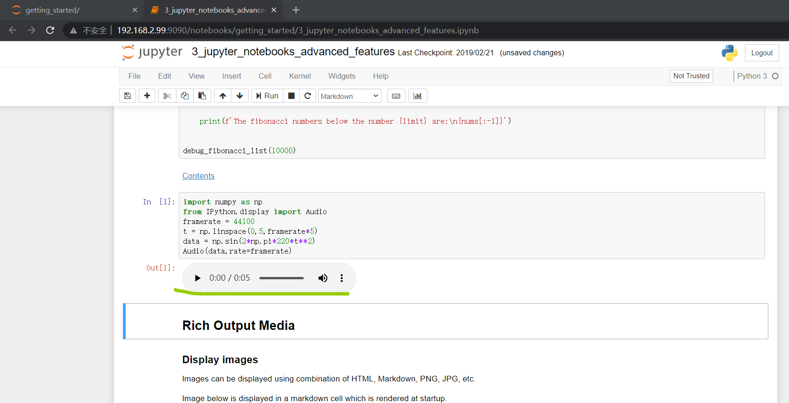

​	点击播放，能听见音频

### 5.测试usb

​	未接入设备时，在终端输入命令`lsusb`

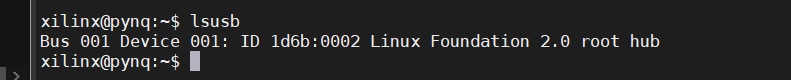

​	接入U盘，再次输入命令`lsusb`

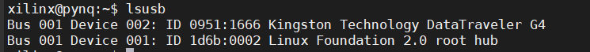

​	此时已打印出U盘的设备信息，可见usb正常

​												**至此，恭喜！你已经成功拥有一个具有基本功能的PYNQ了！**
### 6.参考镜像
​	链接：[百度网盘链接](https://pan.baidu.com/s/1l0jOhZQdrDqs8EKqCY8jVQ)

​	提取码：yes1

​	*注：本镜像适用于微相Pynq-Lite7010，其他的硬件平台请自行制作。*

​	**禁止用于商业用途！！！！！！！！！！**

​	*喜欢的话别忘记分享哦，若有问题、建议或使用反馈，请发送至邮箱1317783287@qq.com*

​	*后续更改会同步发布到[github](https://github.com/sure-wang/PYNQ.git)*


--By **NJUPT-EOAST** WXH

